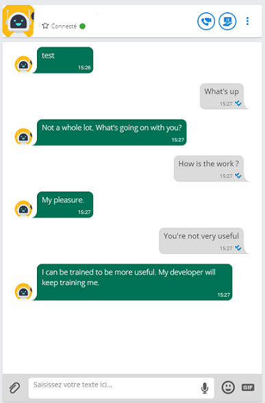
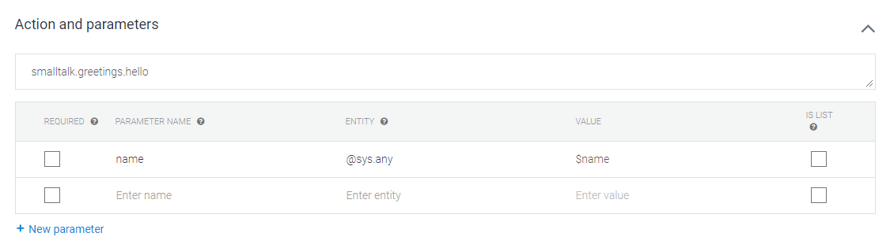
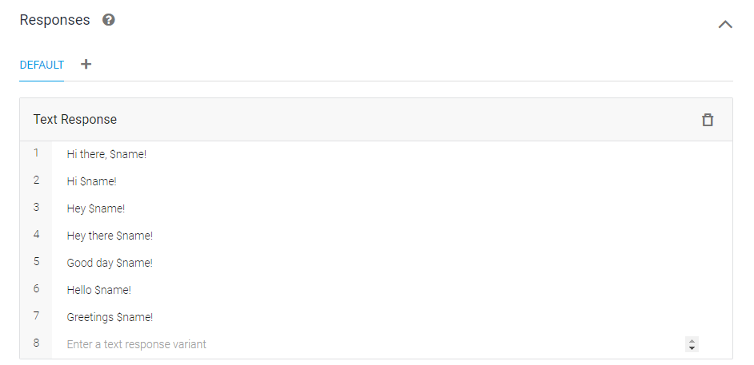

# Rainbow chatbot 🤖🌈

Using rainbow platform (from Alcatel), and Google Dialogflow API
To use it, you need to do a few things:

- Generate a [Dialogflow](https://dialogflow.com/docs/reference/v2-agent-setup) credential key (with your own account)
- Generate a developer account on [rainbow website](https://hub.openrainbow.com/#/)
- Enter all the keys needed in a .env file (you have a .env.sample you can rename and fill with your own values)

## Screen of the chatbot on Rainbow

## Screen of the dialogflow conf

